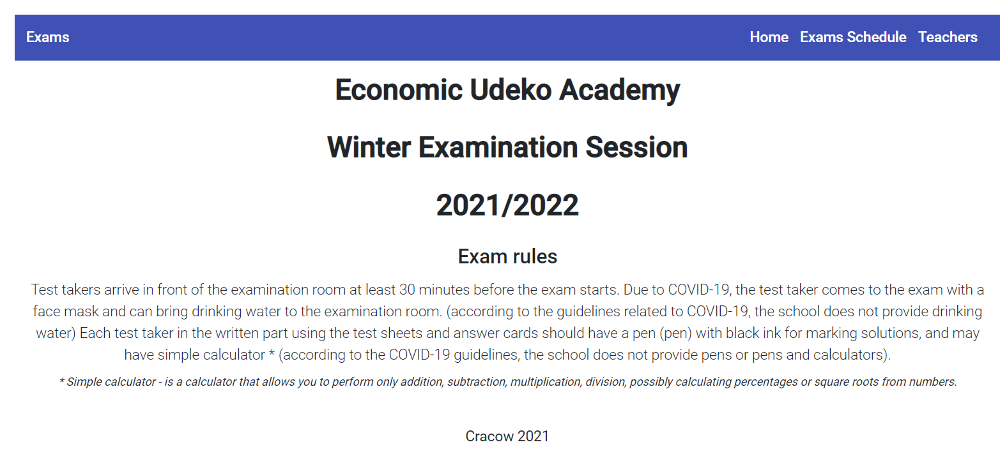
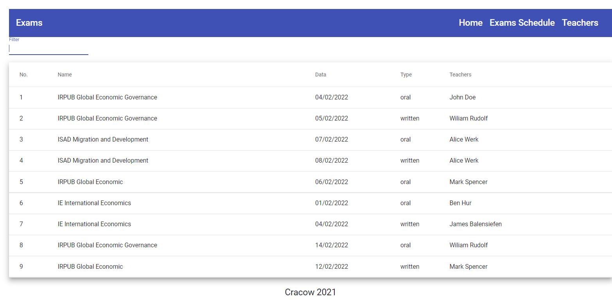

# Getting started with Angular 12 and TypeScript

## General Info

Simple aplication for finding information about exams at studies. 
The user will be able to read the information needed to take the exam.
A table with a list of available exam dates, filterable by subject name and exam type. 
Cards presenting photos of teachers and their contact details.

## Technologies
* HTML 
* CSS 
* JavaScript
* TypeScript
* Bootstrap
* Angular

## Screenshots

## Setup
How to run this project.
1. Clone this repo
2. npm install
3. npm start
3. Open in browser http://localhost:4200/

## Status
Project is finished.
